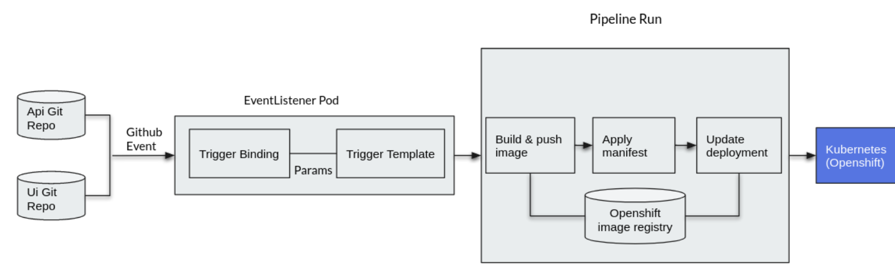

# Openshift Pipeline Trigger Demo

## Prerequisites

- Openshift 4.11+
- Openshift Red Hat Pipeline Operator
- Tekton CLI
- Gitea Github Service

## Pipeline Diagram



## Prepare Project

```bash
oc new-project vote-app
```

Every resource should be created in the `vote-app` project.

## Create PVC

Used to share data between pipeline tasks.

```bash
oc apply -f templates/source-pvc.yaml
```
